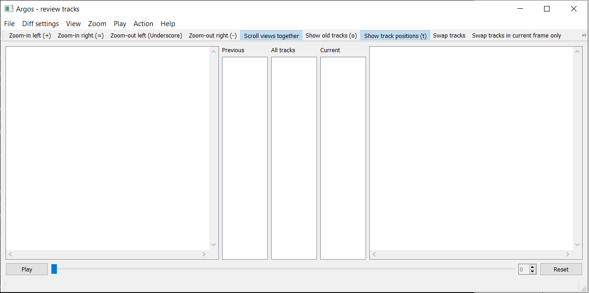
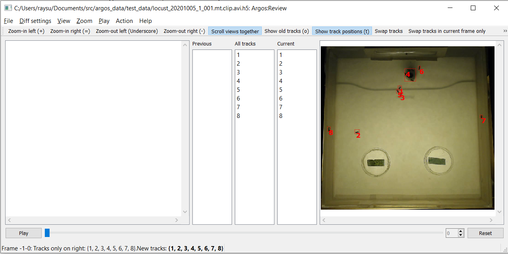
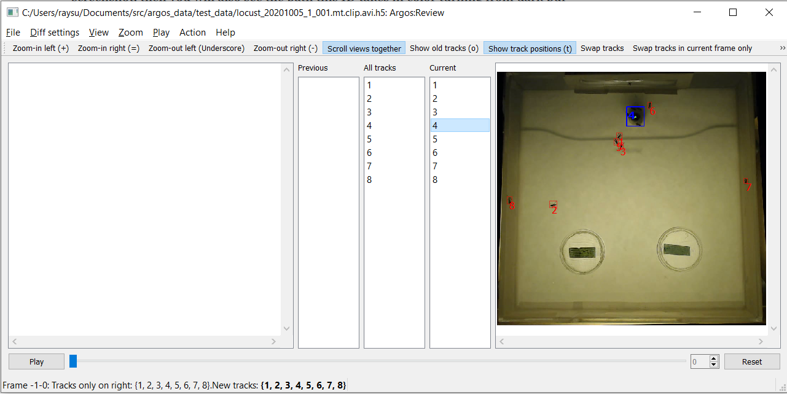
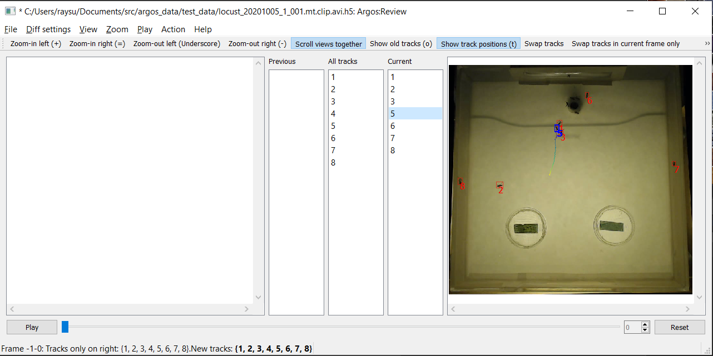
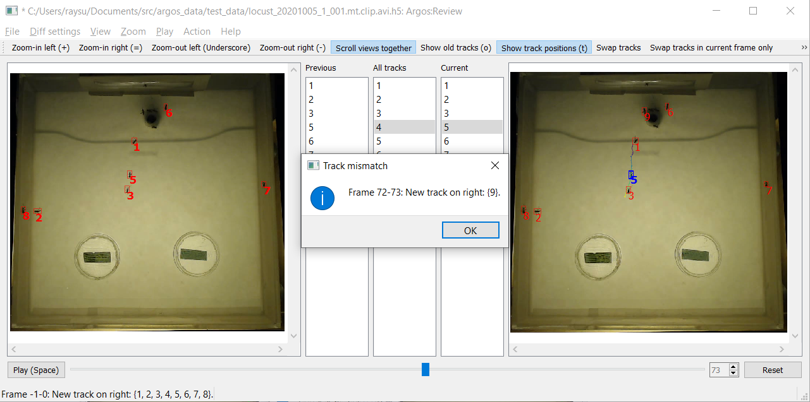
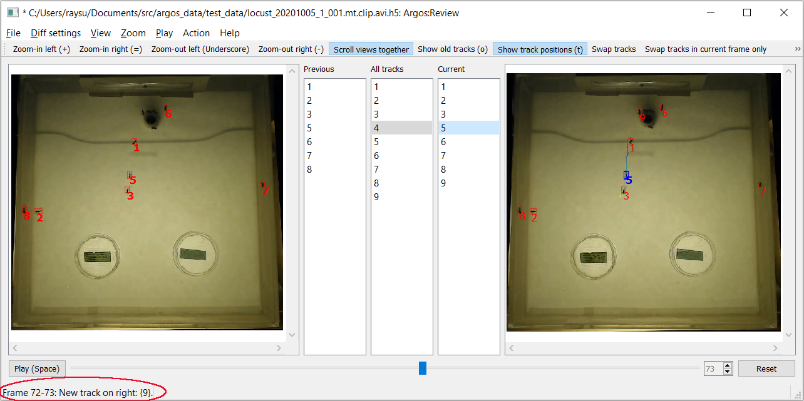
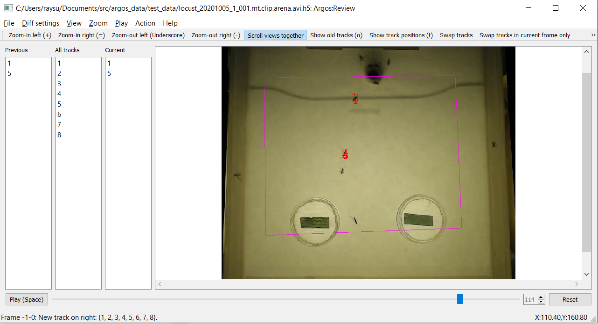
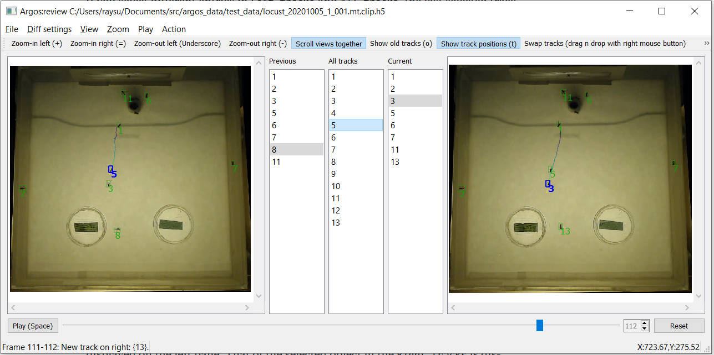

Argos: User Documentation
=========================

========================
Capture or process video
========================
Usage:
::
    python -m argos.capture -i 0 -o myvideo_motion_cap.avi

To see a list of all options try ``python -m argos.capture -h``

The above command will take a snapshot with the default camera on your
computer and ask you to select the region of interest. Click your left
mouse button on one corner of the region of interest and drag to draw
a rectangle. Press ``Enter`` key when done (you may need to press it
twice). If you want to change the selection, or moved the camera to
adjust focus or frame, press ``C`` on the keyboard to update the image
and draw the ROI again. Press ``Enter`` to start recording. This will
create two files, ``myvideo_motion_cap.avi`` containing the recorded
video and ``myvideo_motion_cap.avi.csv`` with the timestamp of each
frame.

`argos.capture` is a simple tool to capture video along with timestamp
for each frame using a camera. It can also be used for recording
videos only when some movement is detected. When applied to a
pre-recorded video file, enabling motion-based capture will keep only
those frames between which *significant movement* has been detected.

What is significant movement?

- The movement detection works by first converting the image into
  gray-scale and blurring it to make it smooth. The size of the
  Gaussian kernel used for blurring is specified by the
  ``--kernel_width`` parameter.

- Next, this blurred grayscale image is thresholded with threshold
  value specified by the ``--threshold`` parameter.

- The resulting binary frame is compared with the blurred and
  thresholded version of the last saved frame. If there is any patch
  of change bigger than ``--min_area`` pixels, then this is considered
  significant motion.

Not all video formats are available on all platforms. The default is
MJPG with AVI as container, which is supported natively by OpenCV.

If you need high compression, X264 is a good option. Saving in X264
format requires H.264 library, which can be installed as follows:

- On Linux: ``conda install -c anaconda openh264``

- On Windows: download released binary from here:
  https://github.com/cisco/openh264/releases and save them in your
  library path.

Examples
--------
1. Read video from file ``myvideo.mpg`` and save output in
``myvideo_motion_cap.avi`` in DIVX format. The ``-m --threshold=20 -a
10`` part tells the program to detect any movement such that more than
10 contiguous pixels have changed in the frame thresholded at 20:
frames
::
    python -m argos.capture -i myvideo.mpg -o myvideo_motion_cap.avi  \\
    --format=DIVX -m --threshold=20 -a 10

The recording will stop when the user presses ``Escape`` or ``Q`` key.

2. Record from camera# 0 into the file ``myvideo_motion_cap.avi``:
::
    python -m argos.capture -i 0 -o myvideo_motion_cap.avi

3. Record from camera# 0 for 24 hours, saving every 10,000 frames into a
separate file:
::
    python -m argos.capture -i 0 -o myvideo_motion_cap.avi \\
    --duration=24:00:00 --max_frames=10000

This will produce files with names ``myvideo_motion_cap_000.avi``,
``myvideo_motion_cap_001.avi``, etc. along with the timestamps in files named
``myvideo_motion_cap_000.avi.csv``, ``myvideo_motion_cap_001.avi.csv``. The
user can stop recording at any time by pressing ``Escape`` or ``Q`` key.

4. Record a frame every 3 seconds:
::
    python -m argos.capture -i 0 -o myvideo_motion_cap.avi --interval=3.0

Common problem
--------------

When trying to use H264 format for saving video, you may see the
following error:
::
    Creating output file video_filename.mp4
    OpenCV: FFMPEG: tag 0x34363248/'H264' is not supported with codec id 27 and
    format \'mp4 / MP4 (MPEG-4 Part 14)\'
    OpenCV: FFMPEG: fallback to use tag 0x31637661/\'avc1\'

            OpenH264 Video Codec provided by Cisco Systems, Inc.

Solution: Use .avi instead of .mp4 extension when specifying output filename.

=================================
Generate training data for YOLACT
=================================
Usage:
::
    python -m argos.annotate

This program helps you annotate a set of images and export the images and
annotation in a way that YOLACT can process for training. Note that this is for
a single category of objects.

Preparation
-----------
Create a folder and copy all the images you want to annotate into it.

If you have videos instead, you need to extract some video
frames. There are many programs, including most video players, which
can do this. Argos includes a small utility script
:py:mod:`argos.extract_frames` if you need.

Upon startup the program will prompt you to choose the folder
containing the images to be annotated. Browse to the desired image
folder. All the images should be directly in this folder, no
subfolders.

Annotate new images
-------------------
After you select the image folder, the annotator will show you the
main window, with an empty display like below.

   Screenshot of annotate tool at startup

The ``Files/Dirs`` pane on the bottom right lists all the files in the
image directory selected at startup. (Note that this pane may take up
too much screen space. You can close any of the panes using the 'x'
button on their titlebar or or move them around by dragging them with
left mouse button).

The ``Segmentation settings`` pane on right allows you to choose the
parameters for segmentation. See below for details on these settings.

You can press ``PgDn`` key, or click on any of the file names listed
in ``Files/Dirs`` pane to start segmenting the image files. Keep
pressing ``PgDn`` to go to next image, and ``PgUp`` to go back to
previous image.

It can take about a second to segment an image, depending on the image
size and the method of segmentation. Once the image is segmented, the
segment IDs will be listed in ``Segmented objects`` pane on the left.

   Screenshot of annotate tool after segmenting an image.

The image above shows some locusts in a box with petri dishes
containing paper strips. As you can see, the segmentation includes
spots on the paper floor, edges of the petri dishes as well as the
animals. 

We want to train the YOLACT network to detect the locusts. So we must
remove any segmented objects that are not locusts. To do this, click on
the ID of an unwanted object on the left pane listing ``Segmented
objects``. The selected object will be outlined with dotted blue line. 

You can click the ``Remove selected objects`` button on the panel at
the bottom left, or press ``x`` on the keyboard to delete this
segmented object.

   Screenshot of annotate tool for selecting a segmented
   object. Segmented object 16 is part of the petri-dish edge and we
   want to exclude it from the list of annotated objects in this
   image.

Alternatively, if the number of animals is small compared to the
spuriously segmented objects, you can select all the animals by
keeping the ``Ctrl`` key pressed while left-clicking on the IDs of the
animals on the left pane. Then click ``Keep selected objects`` or
press ``k`` on the keyboard to delete all other segmented
objects.

By default, objects are outlined with solid green line, and selected
objects are outlined with dotted blue line. But you can change this
from ``View`` menu. 

In the ``View`` menu you can check ``Autocolor`` to make the program
automatically use a different color for each object. In this case, the
selected object is outlined in a thicker line of the same color, while
all other object outlines are dimmed.

You can also choose ``Colormap`` from the view menu and specify the
number of colors to use. Each object will be outlined in one of these
colors, going back to the first color when all the colors have been
used.

Segmentation settings
---------------------

The segmentation settings pane allows you to control how each image is
segmented. The segmentation here is done in the following steps:

1. Convert the image to gray-scale 

2. Smooth the gray-scale image by Gaussian blurring. For this the
   following parameters can be set:

   - Blur width: diameter of the 2D Gaussian window in pixels 

   - Blur sd: Standard deviation of the Gaussian curve used for
     blurring.

3. Threshold the blurred image. For this the following parameters can
   be set:

   - Invert thresholding: instead of taking the pixels above threshold
     value, take those below. This should be checked when the objects
     of interest are darker than background.

   - Thresholding method: Choice between Adaptive Gaussian and
     Adaptive Mean. These are the two adaptive thresholding methods
     provided by the OpenCV library. In practice it does not seem to
     matter much.

   - Threshold maximum intensity: pixel values above threshold are set
     to this value. It matters only for the Watershed algorithm for
     segmentation (see below). Otherwise, any value above the threshold
     baseline is fine.

   - Threshold baseline: the actual threshold value for each pixel is
     based on this value. When using adaptive mean, the threshold
     value for a pixel is the mean value in its ``block size``
     neighborhood minus this baseline value. For adaptive Gaussian,
     the threshold value is the Gaussian-weighted sum of the values in
     its neighborhood minus this baseline value.

   - Thresholding block size: size of the neighborhood considered for
     each pixel.

   - Segmentation method: This combo box allows you to choose between
     several thresholding methods. 

     - ``Threshold`` and ``Contour`` are essentially the same, with
       slight difference in speed. They both find the blobs in the
       thresholded image and consider them as objects.

     - ``Watershed`` uses the watershed algorithm from OpenCV
       library. This is good for objects covering large patches (100s
       of pixels) in the image, but not so good for very small
       objects. It is also slower than ``Contour/Thresholding``
       methods.

     - ``DBSCAN`` uses the DBSCAN clustering algorithm from
       ``scikit-learn`` package to spatially cluster the non-zero
       pixels in the thresholded image. This is the slowest method,
       but may be good for intricate structures (for example legs of
       insects in an image are often missed by the other algorithms,
       but DBSCAN may keep them depending on the parameter
       settings). When you choose this method, there are additional
       parameters to be specified. For a better understanding of
       DBSCAN algorithm and relevant references see its documentation
       in ``scikit-learn`` package:
       https://scikit-learn.org/stable/modules/generated/sklearn.cluster.DBSCAN.html
       
       - DBSCAN minimum samples: The core points of a cluster should
         include these many neighbors.

       - DBSCAN epsilon: this is the neighborhood size, i.e., each
         core point of a cluster should have ``minimum samples``
         neighbors within this radius. Experiment with it (try values
         like 0.1, 1, 5, etc)!

    - Minimum pixels: filter out segmented objects with fewer than
      these many pixels.

    - Maximum pixels: filter out segmented objects with more than
      these many pixels.

    - Show intermediate steps: used for debugging. Default is
      ``Final`` which does nothing. Other choices, ``Blurred``,
      ``Thresholded``, ``Segmented`` and ``Filtered`` show the output
      of the selected step in a separate window.

    - Boundary style: how to show the boundary of the objects. Default
      is ``contour``, which outlines the segmented objects. ``bbox``
      will show the bounding horizontal rectangles, ``minrect`` will
      show smallest rectangles bounding the objects at any angle, and
      ``fill`` will fill the contours of the objects with color.

    - Minimum width: the smaller side of the bounding rectangle of an
      object should be greater or equal to these many pixels.

    - Maximum width: the smaller side of the bounding rectangle of an
      object should be less than these many pixels.

    - Minimum length: the bigger side of the bounding rectangle of an
      object should be greater or equal to these many pixels.

    - Maximum length: the bigger side of the bounding rectangle of an
      object should be less than these many pixels.

Save segmentation
-----------------

You can save all the data for currently segmented images in a file by
pressing ``Ctrl+S`` on keyboard or selecting ``File->Save segmentation`` from the
menu bar. This will be a Python pickle file (extension ``.pkl`` or
``.pickle``).

Load segmentation
-----------------

You can load segmentation data saved before by pressing ``Ctrl+O`` on
keyboard or by selecting ``File->Open saved segmentation`` from the
menu bar.

Export training and validation data
-----------------------------------

Press ``Ctrl+E`` on keyboard or select ``File->Export training and
validation data`` from menubar to export the annotation data in a
format that YOLACT can read for training.

This will prompt you to choose an export directory. Once that is done,
it will bring up a dialog box as below for you to enter some metadata
and the split of training and validation set.

   Screenshot of annotate tool export annotation dialog

- ``Object class``: here, type in the name of the objects of interest.

- ``Neural-Net base configuration``: select the backbone neural
  network if you are trying something new. The default
  ``yolact_base_config`` should work with the pretrained ``resnet
  101`` based network that is distributd with YOLACT. Other options
  have not been tested much.

- ``Use % of images for validation``: by default we do a 70-30 split
  of the available images. That is 70% of the images are used for
  training and 30% for validation.

- ``Split into subregions``: when the image is bigger than the neural
  network's input size (550x550 pixels in most cases), randomly split
  the image into blocks of this size, taking care to keep at least one
  segmented object in each block. These blocks are then saved as
  individual training images.

- ``Export boundaries as``: you can choose to give the detailed
  contour of each segmented object, or its axis-aligned bounding
  rectangle, or its minimum-area rotated bounding rectangle
  here. Contour provides the most information.

  Once done, you will see a message titled ``Data saved`` showing the
  command to be used for training YOLACT. It is also copied to the
  clipboard, so you can just use the ``paste`` action on your
  operating system to run the training from a command line.

   Screenshot of suggested command line after exporting annotations.

============================
Track objects interactively
============================

Usage:
::
    python -m argos.track

In Argos, this is the main tool for tracking objects
automatically. Argos tracks objects in two stages, first it segments
the individual objects (called instance segmentation) in a frame, and
then matches the positions of these segments to that in the previous
frame.

The segmentation can be done by a trained neural network via the
YOLACT library, or by classical image processing algorithms. Each of
these has its advantages and disadvantages.

Basic usage
-----------

This assumes you have a YOLACT network trained with images of your
target object. YOLACT comes with a network pretrained with a variety
of objects from the COCO database. If your target object is not
included in this, you can use the Argos annotation tool
(:py:mod:`argos.annotate`) to train a backbone network.

When you start Argos tracker, a window with an empty central widget is
presented (:numref:`track_startup`).

.. _track_startup:
.. figure:: ../doc/images/track_00.png
   :width: 100%
   :alt: Screenshot of tracking tool at startup

   Screenshot of tracking tool at startup

1. Use the ``File`` menu to open the desired video.  After selecting
   the video file, you will be prompted to:

    1. Select output data directory/file. You have a choice of CSV
       (text) or HDF5 (binary) format. HDF5 is recommended.

    2. Select Yolact configuration file, go to the `config` directory
       inside argos directory and select `yolact.yml`.

    3. File containing trained network weights, and here you should
       select the `babylocust_resnet101_119999_240000.pth` file.

2. This will show the first frame of the video in the central
   widget. On the right hand side you can set some parameters for the
   segmentation (:numref:`track_loaded`).

   .. _track_loaded:
   .. figure:: ../doc/images/track_01.png
      :width: 100%
      :alt: Tracking tool after loading video and YOLACT configuration and network weights.
   
      Tracking tool after loading video and YOLACT configuration and
      network weights.

   The top panel on the right is ``Yolact settings`` with the
   following fields:

   1. ``Number of objects to include``: keep at most these many
      detected objects.

   2. ``Detection score minimum``: YOLACT assigns a score between 0
      and 1 to each detected object to indicate how close it is to
      something the network is trained to detect. By setting this
      value higher, you can exclude spurious detection. Set it too
      high, and decent detections may be rejected.

   3. ``Merge overlaps more than``: If the bounding boxes of two
       detcted objects overlap more than this fraction of the smaller
       one, then consider them parts of the same object.

   The next panel, ``Size limits`` allows you to filter objects that
   are too big or too small. Here you can specify the minimum and
   maximum width and length of the bounding boxes, and any detection
   which does not fit will be removed.

   The bottom panel, ``SORTracker settings`` allows you to parametrize
   the actual tracking. SORTracker matches objects between frames by
   their distance. Default distance measure is ``Intersection over
   Union`` or IoU. This is the ratio of the area of intersection to
   the union of the two bounding boxes. 

   - ``Minimum overlap``: if the overlap between predicted position of
     an object and the actual detected position in the current frame is
     less than this, it is considered to be a new object. Thus, if an
     animal jumps from one position to a totally different position, the
     algorithm will think that a new object has appeared in the new
     location.

   - ``Minimum hits``: to avoid spurious detections, do not believe a
     detected object to be real unless it is detected in this many
     consecutive frames.

   - ``Maximum age``: if an object goes undetected for this many
     frames, remove it from the tracks, assuming it has gone out of
     view.

3. Start tracking: click the ``Play/Pause`` button and you should see
   the tracked objects with their bounding rectangles and Ids. The
   data will be saved in the filename you entered in step above
   (:numref:`track_running`).

   .. _track_running:
   .. figure:: ../doc/images/track_02.png
      :width: 100%
      :alt: Tracking in progress
   
      Tracking in progress. The bounding boxes of detected objects are
      outlined in green. Some spurious detections are visible which can
      be later corrected with the :py:mod:`argos.review` tool.

   If you choose CSV above, the bounding boxes of the segmented
   objects will be saved in ``{videofile}.seg.csv`` with each row
   containing `frame-no,x,y,w,h` where (x, y) is the coordinate of
   the top left corner of the bounding box and ``w`` and ``h`` are its
   width and height respectively.
   
   The tracks will be saved in ``{videofile}.trk.csv``. Each row in this
   file contains ``frame-no,track-id,x,y,w,h``.
   
   If you choose HDF5 instead, the same data will be saved in a single
   file compatible with the Pandas library. The segementation data
   will be saved in the group ``/segmented`` and tracks will be saved in
   the group ``/tracked``. The actual values are in the dataset named
   ``table`` inside each group, with columns in same order as described
   above for CSV file. You can load the tracks in a Pandas data frame
   in python with the code fragment:
   ::
           tracks = pandas.read_hdf(tracked_filename, 'tracked')

Classical segmentation
----------------------

Using the ``Segmentation method`` menu you can switch from YOLACT to
classical image segmentation for detecting target objects.  This
method uses patterns in the pixel values in the image to detect
contiguous patches. If your target objects are small but have high
contrast with the background, this may give tighter bounding boxes,
and thus more accurate tracking.
   
When this is enabled, the right panel will allow you to set the
parameters.  The parameters are detailed in
:py:mod:`argos.annotate`.

Briefly, the classical segmentation methods work by first converting
the image to gray-scale and then blurring the image so that sharp
edges of objects are smoothed out. The blurred image is then
thresholded using an adaptive method that adjusts the threshold value
based on local intensity. Thresholding produces a binary image which
is then processed to detect contiguous patches of pixels using one of
the available algorithms.

===============================================
Track objects in batch mode (non-interactively)
===============================================
Usage:
::
     python -m argos.batchtrack -i {input_file} -o {output_file}
     -c {config_file}

Try ``python -m argos.batchtrack -h`` for details of command-line
options.

This program allows non-interactive tracking of objects in a video.
When using classical segmentation this can speed things up by
utilizing multiple CPU cores.

It may be easier to use the interactive tracking :py:mod:`argos.track`
to play with the segmentation parameters to see what work best for
videos in a specific setting. The optimal setting can then be exported
to a configuration file which will then be passed with ``-c`` command
line option .

Examples
--------
Use YOLACT for segmentation and SORT for tracking:
::
    python -m argos.batchtrack -i video.avi -o video.h5 -m yolact \\
    --yconfig=config/yolact.yml -w config/weights.pth -s 0.1 -k 10 \\
    --overlap_thresh=0.3 --cuda=True \\
    --pmin=10 --pmax=500 --wmin=5 --wmax=100 --hmin=5 --hmax=100 \\
    -x 0.3 --min_hits=3 --max_age=20

The above command tells the ``batchtrack`` script to read the input
video ``video.avi`` and write the output to the file ``video.h5``. The
rest of the arguments:

- ``-m yolact`` tells it to use YOLACT as the segmentation method.

- ``--yconfig=config/yolact.yml``: Read YOLACT settings from the file
``config/yolact.yml``

- ``-w config/weights.pth``: Read YOLACT neural network weights from
the file ``config/weights.pth``.

- ``-s 0.1``: Include detections with score above 0.1

- ``-k 10``: Keep only the top 10 detections.

- ``--overlap_thresh=0.3``: At segmentation stage, merge detections
  whose bounding boxes overlap more than 0.3 of their total area.

- ``--cuda=True``: use GPU acceleration.

- ``--pmin=10``: Include objects at least 10 pixels in bounding box
  area.

- ``--pmax=500``: Include objects at most 500 pixels in bounding box
  area.

- ``--wmin=5``: Include objects at least 5 pixels wide.

- ``--wmax=100``: Include objects at most 100 pixels wide.

- ``--hmin=5``: Include objects at least 5 pixels long.

- ``--hmax=100``: Include objects at most 100 pixels long.

- ``-x 0.3``: In the tracking stage, if objects in two successive
  frames overlap more than 0.3 times their combined area, then
  consider them to be the same object.

- ``--min_hits=3``: An object must be detcted at least in 3
  consecutive frames to be included in the tracks.

- ``--max_age=20``: If an object cannot be matched to any detected
  object across 20 successive frames, then discard it (possibly it
  exited the view). [Remember that if you have a 30 frames per second
  video, 20 frames means 2/3 second in real time.]

All of this can be more easily set graphically in
:py:mod:`argos.track` and exported into a file, which can then be
passed with ``-c {config_file}``.

=========================
Review and correct tracks
=========================
Usage:
::
    python -m argos.review

Basic operation
---------------
At startup it will show a window with two empty panes separated in the
middle by three empty lists titled ``Left tracks``, ``All tracks`` and
``Right tracks`` like :numref:`review_startup` below.

.. _review_startup:

   Screenshot of review tool at startup

To start reviewing tracked data, select ``File->Open tracked data``
from the menubar or press ``Ctrl+O`` on keyboard. This will prompt you
to pick a data file. Once you select the data file, it will then
prompt you to select the corresponding video file. Once done, you
should see the first frame of the video on the right pane with the
bounding boxes (referred to as *bbox* for short) and IDs of the tracked
objects (:numref:`review_loaded`).

.. _review_loaded:

   Screenshot of review tool after loading data

Here you notice that trackid ``4`` is spurious. So you select it by
clicking on the entry in ``Right tracks`` list. As you select the
enetry, its bbox and ID on the image change color (and line style)
(:numref:`review_select`). If the ``Show track position`` button is
checked, like in the screenshot, then you will also see some points
turning from dark purple to light yellow, indicating all the position
this object takes across the video.

.. _review_select:

   Screenshot of review tool after selecting object

Now delete object ``4`` by pressing ``x`` or ``Delete`` on keyboard,
or selecting ``Delete track`` from ``Action`` in menubar
(:numref:`review_delete`).

.. _review_delete:

   Screenshot of review tool deleting object

Once you delete ``4``, selection will change to the next object
(#``5``) and the path taken by it over time will be displayed in the
same purple-to-yellow color code (:numref:`review_post_delete`).

.. _review_post_delete:

   Screenshot of review tool after deleting object, as the next object
   is selected.

Now to play the video, click the ``play`` button at bottom. The right
frame will be transfereed to the left pane, and the next frame will
appear in the right pane.

You will notice the spinbox on bottom right updates the current frame
number as we go forward in the video. Instead of playing the video,
you can also move one frame at a time by clicking the up-arrow in the
spinbox, or by pressing ``PgDn`` on keyboard.

It is useful to pause and inspect the tracks whenever a new object is
dected. In order to pause the video when there is a new trackid, check
the ``Show popup message for new tracks`` item in the ``Diff
settings`` menu (:numref:`review_diff_popup_new`).

.. _review_diff_popup_new:
.. figure:: ../doc/images/review_05.png
   :width: 100%
   :alt: Screenshot Diff settings - popup on new tracks menu

   Enable popup message when a new trackid appears

If you you already played through the video, then all trackids are
old. In order to go back to a prestine state, click the ``Reset``
button at bottom right. If you play the video now, as soon as a new
track appears, the video will pause and a popup message will tell you
the new tracks that appeared between the last frame and the current
frame (:numref:`review_new_track_popup`).

.. _review_new_track_popup:

   Popup message when a new trackid appears

After you click ``OK`` to dispose of the popup window, the status
message will remind you of the last change
(:numref:`review_status_msg`).

.. _review_status_msg:

   Status message after a new trackid appears

You can also choose ``Show popup message for left/right mismatch`` in
the ``Diff settings`` menu. In this case whenever the trackids on the
left frame are different from those on the right frame, the video will
be paused with a popup message.

If you want to just watch the video without interruption, select ``No
popup message for tracks``.

The other option ``Overlay previous frame``, if selected, will overlay
the previous frame on the right pane in a different color. This may be
helpful for looking at differences between the two frames if the left
and right display is not good enough (:numref:`review_overlay`).

.. _review_overlay:

   Overlaid previous and current frame. The previous frame is in the
   red channel and the current frame in the blue channel, thus
   producing shades of magenta where they have similar values, and
   more red or blue in pixels where they mismatch.

The track lists 
---------------

The three lists between the left and right video frame in the GUI
present the track Ids of the detected objects. These allow you to
display the tracks and carry out modifications of the tracks described
later).

- ``Left tracks`` shows the tracks detected in the left (previous)
  frame. If you select an entry here, its detected track across frames
  will be overlayed on the previous frame in the left pane
  (:numref:`review_track_hist`).

- ``All tracks`` in the middle shows all the tracks seen so far
  (including those that have been lost in the previous or the current
  frame). If you select an entry here, its detected track across
  frames will be overlayed on the previous frame in the left pane. If
  you select different entries in ``Left tracks`` and ``All tracks``,
  the last selected track will be displayed.

- ``Right tracks`` shows the tracks detected in the current frame.  If
  you select an entry here, its detected track across frames will be
  overlayed on the current frame in the right pane.

.. _review_track_hist:

   The track of the selected object (track Id) in ``Left tracks`` or
   ``All tracks`` is displayed on the left pane. That of the selected
   object in the ``Right tracks`` is displayed on the right pane.

Moving around and break points
------------------------------

To speed up navigation of tracked data, Argos review tool provides
several shortcuts. The corresponding actions are also available in the
``Play`` menu. To play the video, or to stop a video that is already
playing, press the ``Space bar`` on keyboard. You can try to double
the play speed by pressing ``Ctrl + Up Arrow`` and halve the speed by
pressing ``Ctrl + Down Arrow``. The maximum speed is limited by the
time needed to read and display a frame.

Instead of going through the entire video, you can jump to the next
frame where a new trackid was introduced, press ``N`` key (``Jump to
next new track``).

You can jump forward 10 frames by pressing ``Ctrl + PgDn`` and
backward by pressing ``Ctrl + PgUp`` on the keyboard.

To jump to a specific frame number, press ``G`` (``Go to frame``)
and enter the frame number in the dialog box that pops up.

To remember the current location (frame number) in the video, you can
press ``Ctrl+B`` (``Set breakpoint at current frame``) to set a
breakpoint. You can go to other parts of the video and jump back to
this location by pressing ``J`` (``Jump to breakpoint frame``).  To
clear the breakpoint, press ``Shift+J`` (``Clear frame breakpoint``).

You can set a breakpoint on the appearance of a particular trackid
using ``Set breakpoint on appearance`` (keyboard ``A``), and entering
the track id in the dialog box. When playing the video, it will pause
on the frame where this trackid appears next. Similarly you can set
breakpoint on disappearance of a trackid using ``Set breakpoint on
disappearance`` (keyboard ``D``). You can clear these breakpoints by
pressing ``Shift + A`` and ``Shift + D`` keys respectively.

Finally, if you made any changes (assign, swap, or delete tracks),
then you can jump to the frame corresponding to the next change (after
current frame) by pressing ``C`` and to the last change (before
current frame) by pressing ``Shift + C`` on the keyboard.

Correcting tracks
-----------------
Corrections made in a frame apply to all future frames, unless an operation
is for current-frame only. The past frames are not affected by the changes.
You can undo all changes made in a frame by pressing ``Ctrl+z`` when visiting
that frame.

- Deleting

  You already saw that one can delete spurious tracks by selecting it
  on the ``Right tracks`` list and delete it with ``x`` or ``Delete``
  key.

  To delete a track only in the current frame, but to keep future occurrences
  intact, press ``Shift+X`` instead.

  To apply this from the current frame till a specific frame, press ``Alt+X``.
  A dialog box will appear so you can specify the end frame.

- Replacing/Assigning

  Now for example, you can see at frame 111, what has been marked as
  ``12`` was originally animal ``5``, which happened to jump from the
  left wall of the arena to its middle (For this I had to actually
  press ``PgUp`` to go backwards in the video, keeping an eye on this
  animal, until I could be sure where it appeared from). To correct
  the new trackid, we need to assign ``5`` to track id ``12``.

  The easiest way to do this is to use the left mouse button to drag
  the entry ``5`` from either the ``Left tracks`` list or the ``All
  tracks list`` and drop it on entry ``12`` in the ``Right tracks``
  list.  You can also select ``5`` in the left or the middle list and
  ``12`` in the right list and then select ``Replace track`` from the
  ``Action`` menu.

  To apply this only in the current frame keep the ``Shift`` key pressed while
  drag-n-dropping.

  To apply this from the current frame till a specific frame, keep the ``Alt``
  key pressed while drag-n-dropping. A dialog box will appear so you can specify
  the end frame.

- Swapping

  In some cases, especially when one object crosses over another, the
  automatic algorithm can confuse their Ids. You can correct this by
  swapping them.

  To do this, use the right mouse button to drag and drop one entry
  from the ``All tracks`` or ``Left tracks`` list on the other in the
  ``Right tracks`` list. You can also select the track Ids in the
  lists and then click the ``Swap tracks`` entry in the ``Action``
  menu.

  To apply this only in the current frame keep the ``Shift`` key pressed while
  drag-n-dropping.

  To apply this from the current frame till a specific frame, keep the ``Alt``
  key pressed while drag-n-dropping. A dialog box will appear so you can specify
  the end frame.

- Renaming

  To rename a track with a different, nonexistent Id, select the track
  in one of the ``Right tracks`` list and then press the ``R`` key, or
  use the ``Action`` menu to get a prompt for the new Id number. Note
  that normally Argos does not use negative track Id numbers, so for
  temporary use it is safe to use negative numbers and it will not
  conflict with any existing track numbers.

  To apply this only in the current frame keep the ``Shift`` key pressed while
  drag-n-dropping.

All these actions, however, are not immediately made permanent. This
allows you to undo changes that have been made by mistake. You can see
the list of changes you suggested by selecting ``Show list of
changes`` in the view menu, or by using the ``Alt+C`` keyboard
shortcut (:numref:`review_track_changes`). To undo a change, go to the
frame on which it was suggested, and press ``Ctrl+Z``, or select
``Undo changes in current frame`` in the ``Action`` menu.

.. _review_track_changes:

   List of changes to be applied to the tracks. The first entry when
   applied will delete the track Id 8 from frame # 24 onwards. The
   last entry will assign the Id 5 to the track 12 in all frames from
   frame # 111 onwards.

You can save the list of changes into a text file with comma separated
values and load them later using entries in the ``File`` menu. The
changes will become permanent once you save the data (``File->Save
reviewed data``). However, the resulting HDF5 file will include the
list of changes in a time-stamped table
:``changes/changelist_YYYYmmdd_HHMMSS``, so you can refer back to past
changes applied to the data

Tips 
---- 
Swapping and assigning on the same trackid within a single frame can
be problematic.  Sometimes the tracking algorithm can temporarily
mislabel tracks. For example, object `A` (ID=1) crosses over
object `B` (ID=2) and after the crossover object `A` got new
label as ID=3, and object `B` got mislabelled as ID=1. The
best order of action here is to 

(a) swap 3 and 1, and then 
(b) assign 2 to 3. 

This is because sometimes the label of `B` gets fixed automatically by
the algorithm after a couple of frames. Since the swap is applied
first, `B`'s 3 becomes 1, but there is no 1 to be switched to 3, thus
there is no trackid 3 in the tracks list, and the assignment does not
happen, and `A` remains 2. Had we first done the assignment and then
the swap, `B` will get the label 2 from the assignment first, and as
`A` also has label 2, both of them will become 1 after the swap.

Sometimes this may not be obvious because the IDs may be lost for a
few frames and later one of the objects re-identified with the old ID
of the other one.

For example this sequence of events may occur: 
1. A(1) approaches B(2).
2. B(2) Id is lost
3. Both A and B get single bounding box with ID 1.
4. A gets new ID 3. B is lost.
5. A has new ID 3, B reappears with 1.

Action sequence to fix this:
1. Go back where A and B have single ID 1.
2. Swap 2 and 1.
3. Go forward when 3 appears on A.
4. Assign 1 to B.

Swapping IDs multiple times can build-up into-hard-to-fix switches
between IDs, as all the changes in the change list buffer are applied
to all future frames. This can be avoided by saving the data
between swaps. This will consolidate all suggested changes in the
buffer and clear the change list.

After swapping two IDs you may notice that one ID keeps jumping between the two
animals. Even if you do the swap again when this happens in later frame, the IDs
keep switching back and forth. In such a case try doing a temporary swap, i.e.,
a swap that applies to the current frame only.

Whenever there are multiple animals getting too close to each other, a
good approach is to put a breakpoint when the algorithm confuses them
for the first time, and slowly go forward several frames to figure out
what the stable IDs become. Also check how long-lived these IDs are
(if a new ID is lost after a few frames, it may be less work to just
delete it, and interpolate the position in between). Then go back and
make the appropriate changes. Remember that the path history uses the
original data read from the track file and does not take into account
any changes you made during a session. To show the updated path, you
have to first save the data so that all your changes are consolidated.

Selecting a region of interest
------------------------------

You can exclude some spurious detections by defining a region of interest
in the review tool. Click on the right frame with left-mouse button in order
to start drawing a polygon. Keep clicking to add a vertex at current mouse
cursor position. To close the polygon, click as close to the starting point 
as possible. This will crop the frame to polygon and fit it within the view.
As you move forward, any detection outside the polygon will be excluded.

Note on video format 
--------------------
Argos capture utility records video in MJPG format in an AVI container. 
This is available by default in OpenCV. Although OpenCV can read many
video formats via the ``ffmpeg`` library, most common video formats are 
designed for playing sequentially, and jumping back and forth (``seek``)
by arbitrary number of frames is not easy.

With such videos, attempt to jump frames will result in error, and the 
review tool will disable ``seek`` when it detects this. To enable seek 
when the video format permits it, uncheck the ``Disable seek`` item
in the ``Play`` menu.

=============================
Utility to display the tracks
=============================

Usage:
::
    python -m argos.plot_tracks -v {videofile} -f {trackfile} \\
    --torig {original-timestamps-file} \\
    --tmt {motiontracked-timestamps-file} \\
    --fplot {plotfile} \\
    --vout {video-output-file}

Try ``python -m argos.plot_tracks -h`` for a listing of all the
command line options.

This program allows displaying the (possibly motion-tracked) video
with the bounding boxes and IDs of the tracked objects overlaid.
Finally, it plots the tracks over time, possibly on a frame of the
video.

With ``--torig`` and ``--tmt`` options it will try to read the
timestamps from these files, which should have comma separated values
(.csv) with the columns ``inframe, outframe, timestamp`` (If you use
:py:module:``argos.capture`` to capture video, these will be aleady
generated for you). The frame-timestamp will be displayed on each
frame in the video. It will also be color-coded in the plot by
default.

With the ``--fplot`` option, it will save the plot in the filename
passed after it.

With the ``--vout`` option, it will save the video with bounding boxes
in the filename passed after it.

With ``--trail`` option, it will show the trail  of each animal from past
``trail`` frames. However, if ``trail_sec`` flag is set, it will show the trails
 for past ``trail`` seconds.

With ``--randcolor`` flag set, it will draw each track (bbox and ID) in a random
color.

